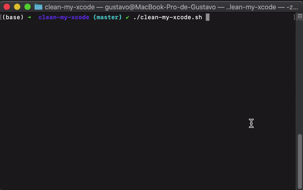

# Clean My Xcode
> A simple Shell script that cleans your Xcode

<p align="center"></p>

Xcode is known to consume large amounts of disk space. This tends to get worse quickly over time, as it keeps even old files created for simulators and past iOS versions, which are not even installed anymore.

## Usage example

Once the clean-my-xcode.sh is downloaded, just run it in the terminal with de command: 

```sh
./clean-my-xcode.sh
```



## Development setup

Describe how to install all development dependencies and how to run an automated test-suite of some kind. Potentially do this for multiple platforms.

```sh
make install
npm test
```

## Script options

* **1 - Device Suport**
    * It's debug symbols/crash logs for each device and iOS version. Do not clean if you need historical crashes
* **2 - Archives**
    * These are created every time you archive an app. Do not clean if you want to debug any of the archived versions of your app
* **3 - Derived Data**
    * Clean intermediate build results, works as a cache. Xcode will recreate the necessary files when a new build is made
* **4 - Core Simulator Devices data**
    * Clean local simulator data: remove installed apps and local data. It's like restoring the simulator to factory settings
* **5 - Core Simulator cache**
    * Clear the simulator caches
* **6 - All**
    * Performs all previous cleanings
* **7 - Quit**
    * Exits the script without making any further changes
